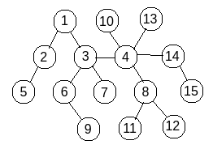

# Лабораторна Робота 1

## Завдання 
Реалізувати програму, що здійснює сліпий прямий пошук цільової вершини в глибину на неорієнтованому графі, (що містить 15 вершин) вглибину.Тестові графи створити  самостійно.

## Побудова

- перейти в директорію "lab1". Команда "cd lab1" 
- створити директорю "build". Команда "mkdir build"
- перейти в  "build". Команда "cd build"
- виконати cmake. Команда "cmake .."
- побудувати проєет. Команда "make"

За шляхом "/lab1/build/bin/" буде знаходитись файл testcase.

## Тестовий випадок

"/lab1/build/bin/testcase" має всередині реалізований наступний граф:

В якому починаючи з 1 вершини відбувається пошук 11 вершини

## Файли лабораторної роботи

### console_log.txt

Текствовий файл з логами виконяння "./lab1/build/bin/testcase"

В ньому записані полсідовність проходження вершин та результат пошуку вершини 1 -> 11.

### graph.hpp

Заголовочний файл, з оголошеннями graph функціоналу

### graph.cpp

Файл з реалізацією graph функціоналу

### testcase.cpp

Файл з реалізованим тестовим випадком

### testgraph.png

Зображення тестового графу

### CMakeLists.txt

Файл з інструкціями побудови проекту

